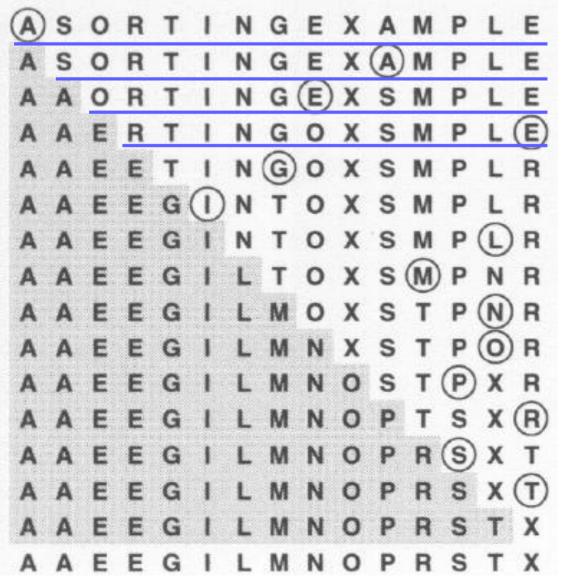
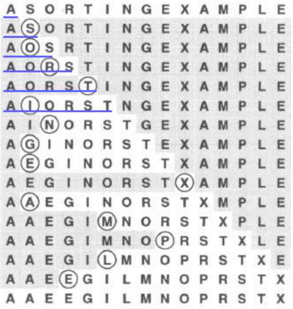
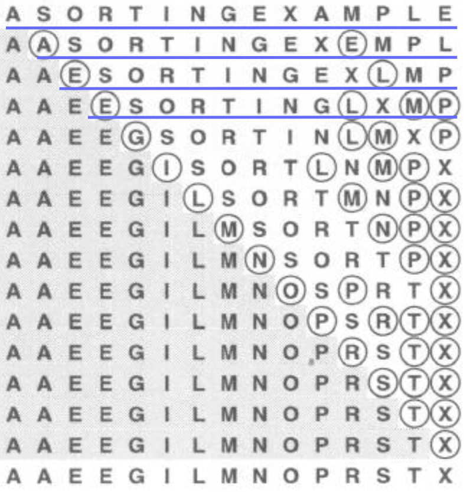

## ソート

### 選択整列法

sort_driver1.c

```sh
$ gcc sort_driver1.c -o sort_driver1
$ ./sort_driver1 5 1 # 第2引数が1の場合は、ランダムに数値３つ
$ ./sort_driver1 5 0 # 第２引数が0の場合は、キーボードがから5個の数字を入力した後、「Enter」, 次に「Ctrl-d」
```

## 整列法の性能
### 実行時間

- 選択整列法, 挿入整列法, バブル整列法: 

- シェルソート : 

### 作業領域
- その場で整列.余分な作業領域は必要なし

---
## *選択整列法*

file : selection.c



- 比較回数 :  回

- 交換回数 :  回 (※ 交換はループの外側にあるため。)

---
## *挿入整列法*

file : insertion.c



- 比較回数 :  回

- 交換回数 :  回

- 選択整列法と異なり、キーがすでに順序通りに並んでいたら、あるいはほとんど順序通りに並んでいたら、挿入整列法は速い

---

## *バブル整列法*



- 比較回数 :  回

- 交換回数 :  回